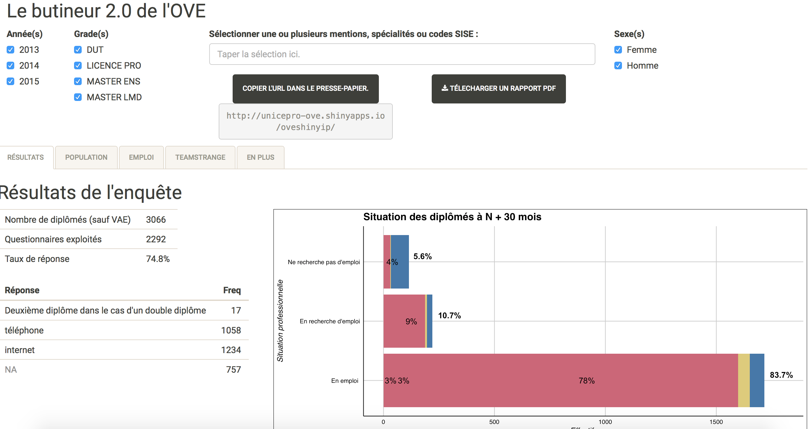

```{r setup, include=FALSE}
knitr::opts_chunk$set(echo = TRUE)
```
## Développement d'application pour l'OVE

### Screen
</br>
</br>




### A propos de 


L'OVE signifie l'Observatoire de la Vie Étudiante et a été créé en 1993, dont le principal but est de réaliser des études à l'aide de questionnaires transmis aux étudiants, pendant leurs études, ou, après l'obtention de leur diplôme. Ainsi, l’OVE a pour mission de donner une information aussi complète et objective que possible sur les conditions de vie des étudiants. 

Le but principale de cette application est de fournir une représentation grahique des données, concernant le taux d'insertion professionnelle des étudiants diplomés. 

## Lancement de l'application web de l'OVE

* Importer le projet sous RStudio
* Se rendre dans "server.R".
* Lancer l'application "Run App"


## Installation des packages

En cas de non lancement de l'application, vérifier que les paquets ci-dessous ne sont pas manquants. 

Installation des packages au préalable :

```{package shiny}
install.packages("shiny")
```

```{package ggplot2}
install.packages("ggplot2")
```

```{package ggthemes}
install.packages("ggthemes")
```

```{package plyr}
install.packages("plyr")
```

```{package gridExtra}
install.packages("gridExtra")
```

```{package grid}
install.packages("grid")
```
